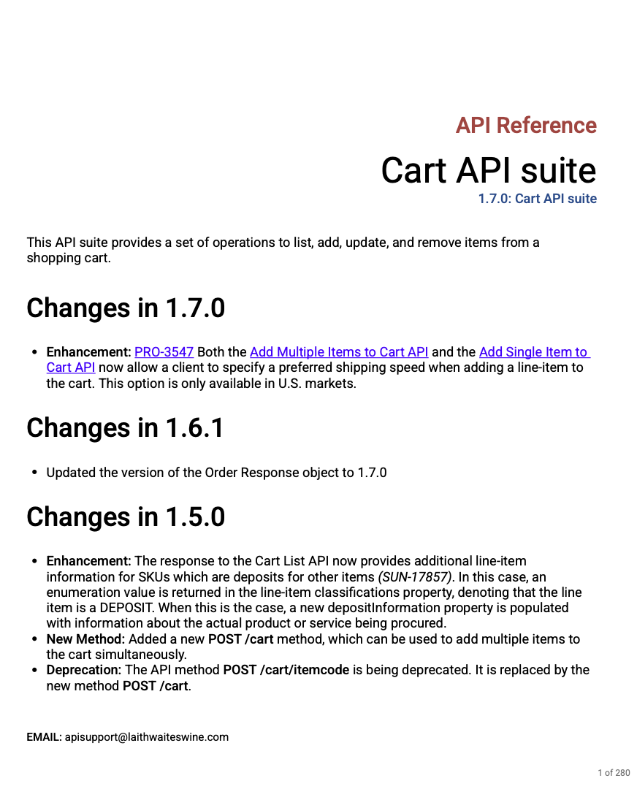
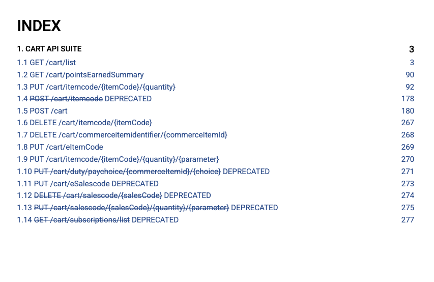
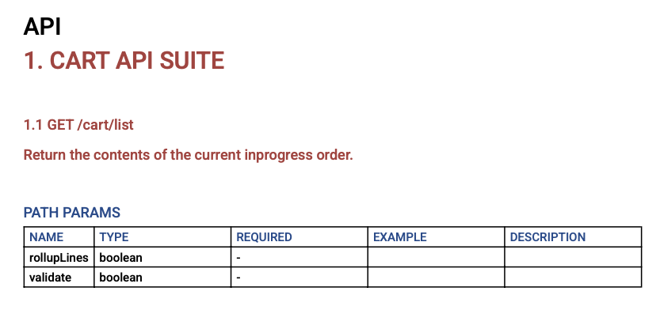
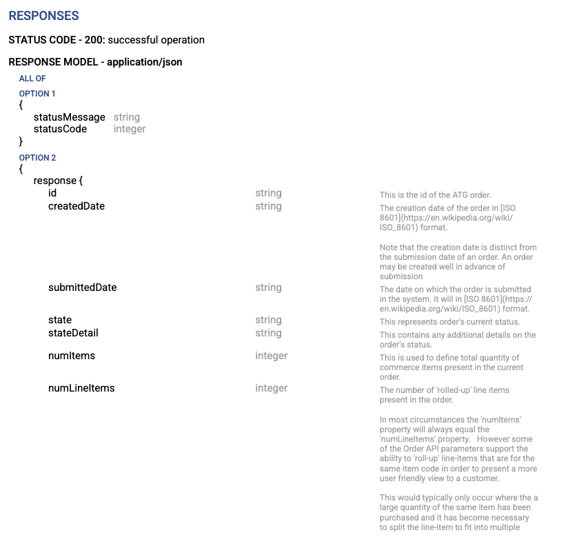
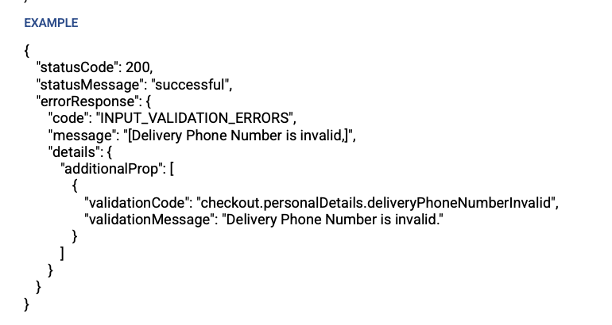

# openapi2pdf

## Introduction

Openapi2pdf is a cli, with you can easily convert your openapi.json or openapi.yml specs from URL or from file to PDF with simple command. It takes few seconds to generate file. All methods are async, and can be used async within projects for async PDF generation.

## Features

* URL api spec support (YML and JSON)
* OpenAPI file spec support (YML and JSON)
* Table of Contents
* Handler description
* Request description
* Response description
* Examples for Response and Request
* OpenAPI3.0 support with AnyOf, OneOf and others
* Enum examples support
* Description for all params in body

## Examples of usage

### Example with URL

```console
openapi2pdf -s https://app.swaggerhub.com/apiproxy/registry/Direct_Wines/CartAPISuite/1.7.0\?resolved\=true\&flatten\=true\&pretty\=true -o pdfDocs.pdf
```

### Example with file

#### JSON

```console
openapi2pdf -s openapi.json -o pdfDocs.pdf
```

#### YML 

```console

openapi2pdf -s openapi.yml -o pdfDocs.pdf
```

## PDF examples

### Info



### Index



### Paths Header



### Response Description



### Example



